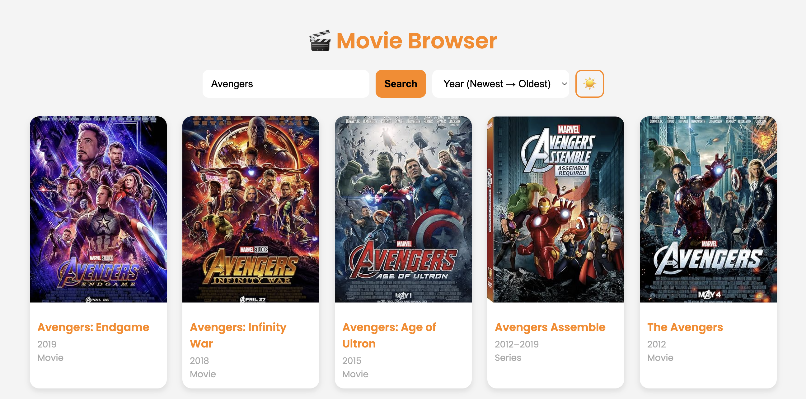

# Movie Browser 🎬

A responsive and interactive web application that lets users search, browse, and sort movies using the **OMDb API**. The app also features light/dark mode toggling and a modern, clean design.

---

## Features

- Search for movies by title
- Display movie poster, title, year, and type
- Sort results by:
  - Year (ascending/descending)
  - Title (A → Z / Z → A)
- Toggle between light and dark themes
- Responsive grid layout for mobile and desktop
- Smooth hover effects on movie cards

---

## Demo

  

---

## Tech Stack

- **Frontend:** HTML, CSS, JavaScript  
- **API:** [OMDb API](http://www.omdbapi.com/)  

---

## Installation & Setup

1. Clone the repository:

```bash
git clone https://github.com/yourusername/movie-browser.git
cd movie-browser
```

2. Open index.html in your browser (no backend needed).

3. API Key:
   Replace the apiKey variable in script.js with your own OMDb API key:

```javascript
const apiKey = "YOUR_API_KEY";
